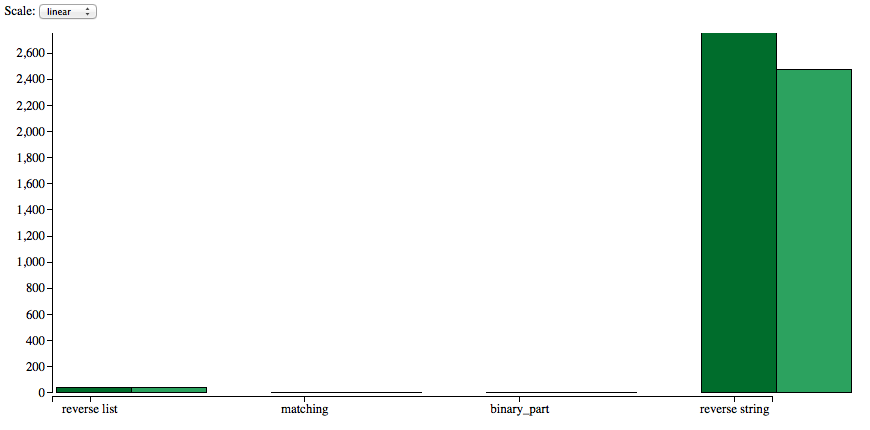

Benchfella
==========

[](https://hex.pm/packages/benchfella)


Microbenchmarking tool for Elixir.

## Overview

With Benchfella you can define small tests and it will intelligently run each individual one to
obtain a more or less reliable estimate of the average run time for each test.

The key features of Benchfella:

  * very easy to write and run microbenchmarks
  * compare measurements between multiple runs
  * plot results of multiple runs

If you are looking for a more elaborate treatment of the measurements, take a look at
[bmark](https://github.com/joekain/bmark) which employs mathematical statistics to compare
benchmarking results and determine their credibility.


## Installation

Add `benchfella` as a dependency to your project:

```elixir
# in your mix.exs

defp deps do
  [{:benchfella, "~> 0.3.0"}]
end
```

This will make the new tasks available in the root directory of your Mix project.

Any project will do, so if you just want to measure a snippet of code quickly, create a bare-bones
Mix project with `mix new`, create a subdirectory called `bench` in it and put your benchmark
definitions there. See examples below.

## Usage

Take a moment to study the output of running `mix help bench` and `mix help bench.cmp` inside your
Mix project to see all supported options.

In order to start writing tests, add a directory called `bench` and put files with names that match
the pattern `*_bench.exs` in it. Then run `mix bench` in the root directory of your project.
Benchfella will then load each test and execute it for as many iterations as necessary so that the
total running time is at least the specified duration.

Example:

```elixir
# bench/basic_bench.exs
defmodule BasicBench do
  use Benchfella

  @list Enum.to_list(1..1000)

  bench "hello list" do
    Enum.reverse @list
  end
end
```

```sh
$ mix bench
Settings:
  duration:      1.0 s

## BasicBench
[13:23:58] 0/1: hello list

Finished in 3.15 seconds

## BasicBench
hello list      500000   5.14 µs/op
```

In the end, the number of iterations and the average time of a single iteration are printed to the
standard output. Additionally, the output in machine format is written to a snapshot file in
`bench/snapshots/`.


### `setup_all` and `teardown_all`

`setup_all/0` lets you perform some code before the first test in a module is run.
It takes no arguments and should return `{:ok, <context>}` where `<context>` is
any term, it will be passed into `before_each_bench/1` and `teardown_all/1` if they are
defined. Returning any other value will raise an error and cause the whole
module to be skipped.

`teardown_all/1` lets you do some cleanup after the last test in a module has
finished running. It takes the context returned from `setup_all/0` (`nil` by
default) as its argument.

```elixir
# bench/sys_bench.exs
defmodule SysBench do
  use Benchfella

  setup_all do
    depth = :erlang.system_flag(:backtrace_depth, 100)
    {:ok, depth}
  end

  teardown_all depth do
    :erlang.system_flag(:backtrace_depth, depth)
  end

  @list Enum.to_list(1..10000)

  bench "list reverse" do
    Enum.reverse(@list)
  end
end
```

### `before_each_bench` and `after_each_bench`

`before_each_bench/1` runs before each individual test is executed. It
takes the context returned from `setup_all/0` and should return `{:ok,
<bench_context>}` where `<bench_context>` is any term. Returning any other value
will raise an error and cause the current test to be skipped.

`<bench_context>` returned from `before_each_bench/1` will be available as the
`bench_context` variable in each test.

`after_each_bench/1` runs after each individual test has been executed. It
takes the context returned from `before_each_bench/1` as its argument.

```elixir
# bench/ets_bench.exs
defmodule ETSBench do
  use Benchfella

  before_each_bench _ do
    tid = :ets.new(:my_table, [:public])
    {:ok, tid}
  end

  after_each_bench tid do
    IO.inspect length(:ets.tab2list(tid))
    :ets.delete(tid)
  end

  bench "ets insert", [_unused: inspect_table(bench_context)] do
    tid = bench_context
    :ets.insert(tid, {:random.uniform(1000), :x})
    :ok
  end

  defp inspect_table(tid) do
    IO.inspect :ets.info(tid)
  end
end
```

### Run time values

When you need to generate inputs for tests at run time without affecting the measurements and you
can't use `before_each_bench/1` hook for that, the following trick can be used:

```elixir
# bench/string_bench.exs
defmodule StringBench do
  use Benchfella

  bench "reverse string", [str: gen_string()] do
    String.reverse(str)
  end

  defp gen_string() do
    String.duplicate("abc", 10000)
  end
end
```

### `mix bench.cmp`

To compare results between multiple runs, use `mix bench.cmp`.

```sh
# Run 'mix bench' one more time.
# Each run automatically saves a snapshot in bench/snapshots.
$ mix bench
...

# 'mix bench.cmp' will read the two latest snapshots by default.
# You could also pass the snapshot files to compare as arguments.
$ mix bench.cmp -d percent
bench/snapshots/2015-03-26_01-17-17.snapshot vs
bench/snapshots/2015-03-26_01-19-30.snapshot

## ListBench
reverse list              -10.32%

## StringBench
reverse string dynamic    +2.26%
reverse string            +3.33%
```

### `mix bench.graph`

Benchfella can produce an HTML page with graphs providing various insights into
the raw data obtained from running `mix bench`.

```sh
# run the benchmarks twice
$ mix bench
...
$ mix bench
...

# 'mix bench.graph' works similarly to 'mix bench.cmp' except it can display
# all given snapshots on one graph.
$ mix bench.graph
Wrote bench/graphs/index.html

$ open bench/graphs/index.html
```




## License

This software is licensed under [the MIT license](LICENSE).
